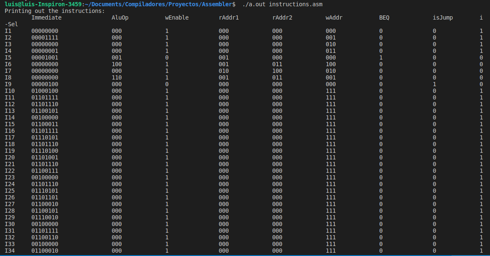
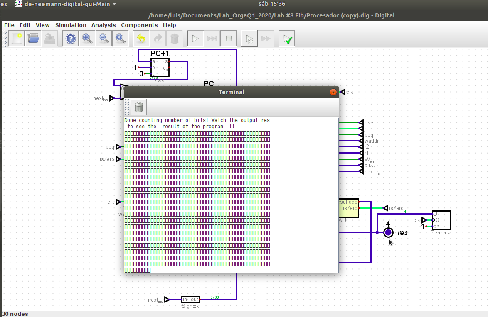

Assembler that translates a custom assembly language into a 24-bit binary code

The binary that this assembler outputs runs on this 24-bit simple processor:


# Assembly Syntax

## C Program


## Assembly Equivalent
```
    li $r0, 0  //Load 0 to register $r0
    li $r1, 15 //n
    li $r2, 0  //count 
    li $r3, 1  //Load 1 to register $r3
WHILE:
    beq $r1, $r0, RETURNCOUNT 
    and $r4, $r1, $r3 //n & 1
    add $r2, $r2, $r4 //count = count + (n&1)
    srl $r1, $r1, $r3 //n >>= 1 (n = n >> 1)
    jmp WHILE

RETURNCOUNT:
    //Print to the terminal
    li $r7, 'D'
    li $r7, 'o'
    li $r7, 'n'
    li $r7, 'e'
    li $r7, ' ' 
    li $r7, 'c'
    li $r7, 'o'
    li $r7, 'u'
    li $r7, 'n'
    li $r7, 't'
    li $r7, 'i'
    li $r7, 'n'
    li $r7, 'g'
    li $r7, ' '
    li $r7, 'n'
    li $r7, 'u'
    li $r7, 'm'
    li $r7, 'b'
    li $r7, 'e'
    li $r7, 'r'
    li $r7, ' '
    li $r7, 'o'
    li $r7, 'f'
    li $r7, ' '
    li $r7, 'b'
    li $r7, 'i'
    li $r7, 't'
    li $r7, 's'
    li $r7, '!'
    li $r7, ' '
    li $r7, 'W'
    li $r7, 'a'
    li $r7, 't'
    li $r7, 'c'
    li $r7, 'h' 
    li $r7, ' '
    li $r7, 't'
    li $r7, 'h'
    li $r7, 'e'
    li $r7, ' '
    li $r7, 'o'
    li $r7, 'u'
    li $r7, 't'
    li $r7, 'p'
    li $r7, 'u'
    li $r7, 't'
    li $r7, ' '
    li $r7, 'r'
    li $r7, 'e'
    li $r7, 's'
    li $r7, ' '
    li $r7, 't'
    li $r7, 'o'
    li $r7, ' '
    li $r7, 's'
    li $r7, 'e'
    li $r7, 'e'
    li $r7, ' '
    li $r7, 't'
    li $r7, 'h'
    li $r7, 'e'
    li $r7, ' '
    li $r7, ' ' 
    li $r7, 'r'
    li $r7, 'e'
    li $r7, 's'
    li $r7, 'u'
    li $r7, 'l'
    li $r7, 't'
    li $r7, ' '
    li $r7, 'o'
    li $r7, 'f'
    li $r7, ' '
    li $r7, 't'
    li $r7, 'h'
    li $r7, 'e'
    li $r7, ' '
    li $r7, 'p'
    li $r7, 'r'
    li $r7, 'o'
    li $r7, 'g'
    li $r7, 'r'
    li $r7, 'a'
    li $r7, 'm'
    li $r7, ' '
    li $r7, ' '
    li $r7, '!'
    li $r7, '!'
    li $r7, 10  //ASCII code of endline
    add $r7, $r0, $r2  //r7 = count
    looper: jmp looper //Create a infinite loop in order for $r7 to keep its state
```

The assembler will generate a .hex file which contains the hexadecimal representation of the binary code of the assembly program which the processor understands.

## Output: 



## Processor output of the program

